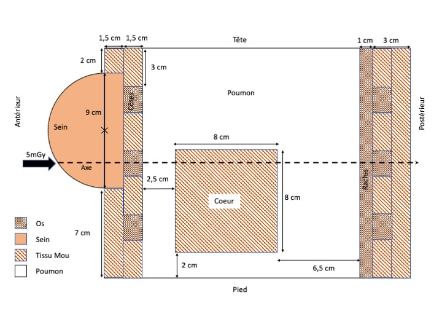

# Travaux Pratiques de Modélisation pour la Dosimétrie

## TP #2 : Étude Radiologique d'un Fantôme Anthropomorphique

### Contacts:

- Véronica Sorgato: [veronica.sorgato88@googlemail.com](mailto:veronica.sorgato88@googlemail.com)
- Samy Kefs: [samy.kefs@inserm.fr](mailto:samy.kefs@inserm.fr)
- Yannick Arnoud: [yannick.arnoud@lpsc.in2p3.fr](mailto:yannick.arnoud@lpsc.in2p3.fr)

### Données:

À partir du site du NIST, récupérer dans un fichier Excel les coefficients d'atténuation $ \mu_{att}$ et d'absorption en énergie $\mu_{en}$ des tissus mous, de l'os, du poumon et de l'eau, en fonction de l'énergie des photons, listés dans les fichiers suivants :

- SoftTissueNIST.xlsx
- BreastTissueNIST.xlsx
- CorticalBone-NIST.xlsx
- LungNIST.xlsx
- WaterNIST.xlsx

Ces données sont extraites de la base de données du NIST. Vous disposez également du fichier airNISTxmudat.xlsx qui contient les coefficients d'atténuation, de transmission et d'absorption en énergie pour l'air.

Densité des tissus:
- Tissus mous: $1.02 g/cm^{-3}$
- Tissue mammaires : $0.95 g/cm^{-3}$
- Os: $1.85 g/cm^{-3}$
- Poumon: $1.05 g/cm^{-3}$
- Air: $1.21 \times 10^{-3} g/cm^{-3}$

On considère des faisceaux de photons parallèles aux énergies suivantes:
- 20 keV
- 140 keV
- 6 MeV
- 18 MeV

On considère la géométrie du patient suivante (vue sagittale). Il s'agit d'une vue 2D, et on considérera des pixels de 1x1 mm².

